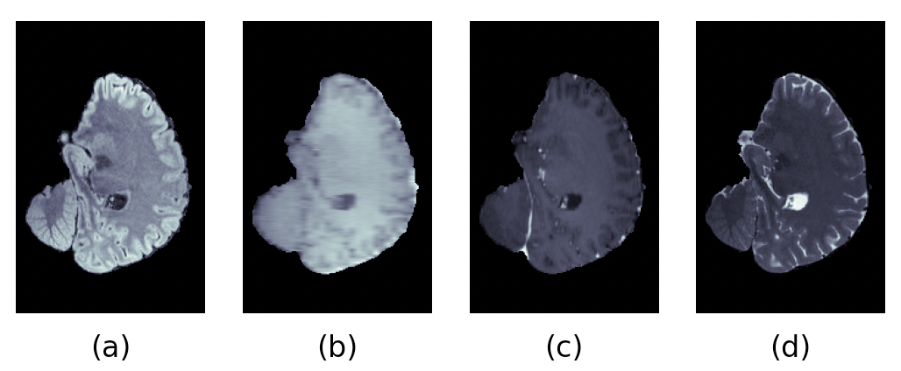
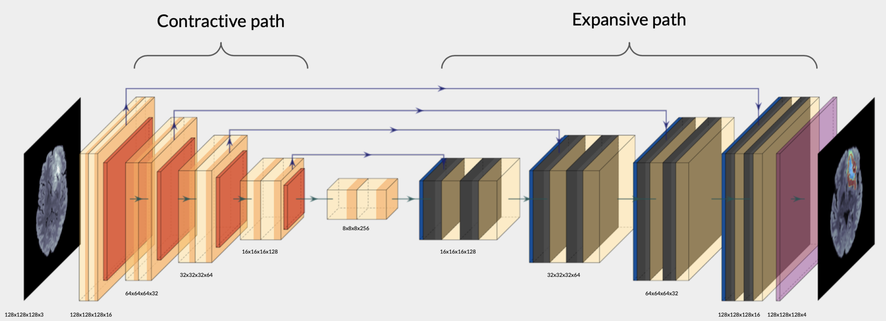
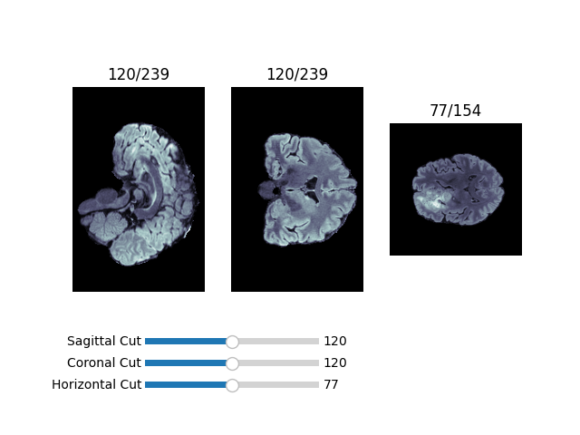
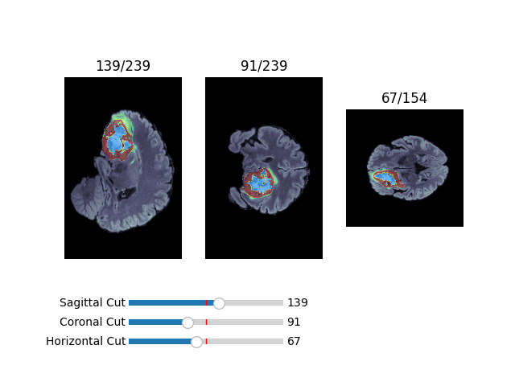
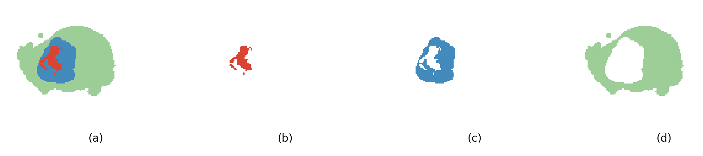

# Brain Tumor Segmentation using U-Net (BraTS 2020)

[](https://www.python.org/)
[](LICENSE)
[](https://www.kaggle.com/datasets/awsaf49/brats20-dataset-training-validation)

## Project Overview

Brain tumors are complex structures that vary significantly in size, shape, and position. Accurately segmenting these tumors is critical for diagnosis, treatment planning, and monitoring disease progression.

This project implements a Deep Learning pipeline to perform automatic 3D semantic segmentation of brain tumors. Leveraging the **BraTS 2020 Dataset**, the system utilizes multi-modal MRI scans to identify specific tumor sub-regions (edema, enhancing tumor, and non-enhancing tumor core).

## MRI Modalities (Sequences)

Medical segmentation relies on "multi-modal" data, meaning different types of MRI sequences are used together to highlight different tissue properties. This model utilizes the four standard BraTS sequences:



* **T1-weighted (T1):** Provides basic anatomical structure.
* **T1-weighted with Gadolinium contrast (T1ce):** Highlights the **active tumor core**. The contrast agent accumulates in areas with a disrupted blood-brain barrier, making the tumor appear bright.
* **T2-weighted (T2):** Highlights water and fluid. It is useful for visualizing the **edema** (swelling) surrounding the tumor, as well as the tumor core.
* **FLAIR (Fluid Attenuated Inversion Recovery):** Similar to T2 but suppresses the signal from cerebrospinal fluid (CSF). This makes it the optimal sequence for separating **edema** from normal brain fluid.

## U-Net Architecture

The core of this project is the **U-Net architecture**, a convolutional neural network designed specifically for biomedical image segmentation.



The architecture derives its name from its "U" shape, consisting of two symmetric paths:

1.  **The Contracting Path (Encoder):**
    * Acts as a traditional feature extractor.
    * Consists of repeated convolutions and max-pooling operations.
    * **Goal:** To capture the **context** of the image (what is present?).

2.  **The Expansive Path (Decoder):**
    * Uses up-sampling (transposed convolutions) to restore the image to its original spatial resolution.
    * **Goal:** To achieve precise **localization** (where is it present?).

3.  **Skip Connections:**
    * A critical feature of U-Net. High-resolution features from the Contracting path are concatenated with the up-sampled output in the Expansive path.
    * This allows the network to recover spatial information lost during pooling, resulting in sharper segmentation masks.

## Getting Started

### Prerequisites
Ensure you have your [Kaggle API Key](https://www.kaggle.com/docs/api) configured to download the dataset.

### Installation & Usage
The [main.ipynb](main.ipynb) notebook walks through the entire pipeline:
1.  Data Loading & Pre-processing (NIfTI handling).
2.  Model Training.
3.  Evaluation.

### Demo
To run the inference demo script:

```bash
cd demo
python presentation_demo.py
```

### Training & Experiment Tracking
Training metrics are tracked using MLflow and TensorBoard.

To view the training history, loss curves, and metric evolution (Dice Coefficient/F1 Score and IoU):

```bash
python3 -m mlflow ui
```

## Visualization Gallery
### 3D Volumetric Visualization
A 3D reconstruction of the brain helps in understanding the spatial distribution of the tumor.




### Tumor Sub-regions (Labels)
Visualizing the specific segmentation classes (Edema, Enhancing Tumor, Necrosis).


